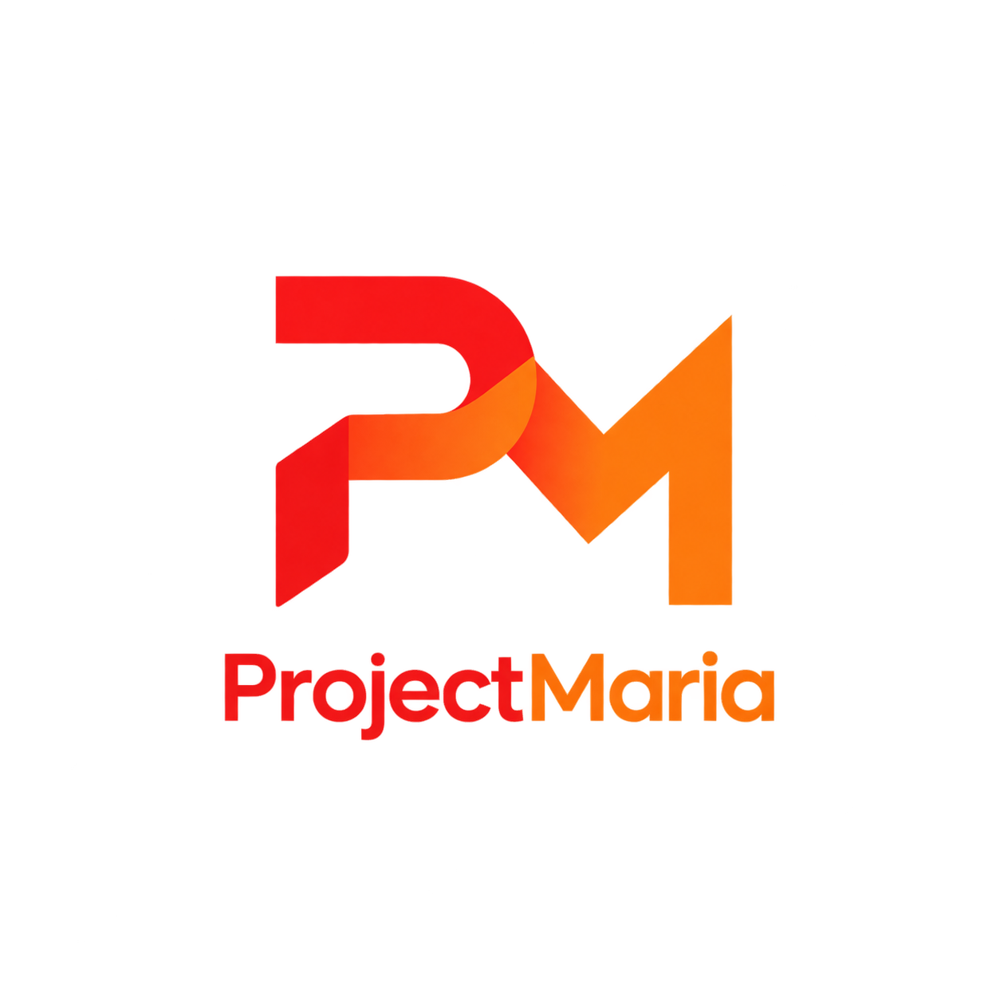

  

<h1 align="center">ProjectMaria</h1>

  A modern game engine.

# ProjectMaria
 
A multi-game platform built in C++, developed by 1 dude.
 
## Goal
 
Build a C++ platform that hosts multiple games in one place, launched from a single application.
 
## Contributors
 
None, at the moment.

## Programming languages

- C++

## Plan

Add new features.
Be more creative.

- StovDev

